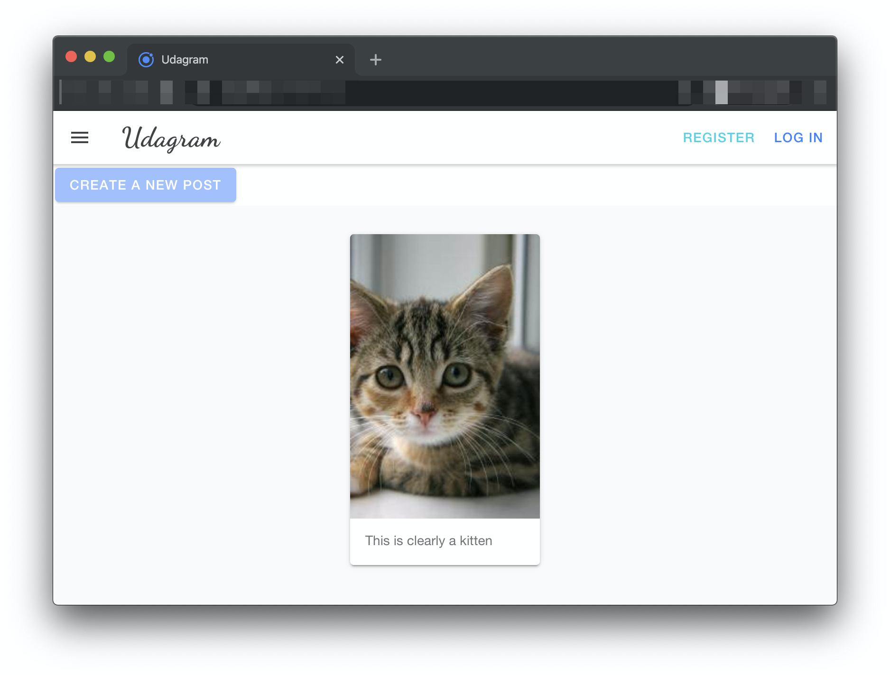
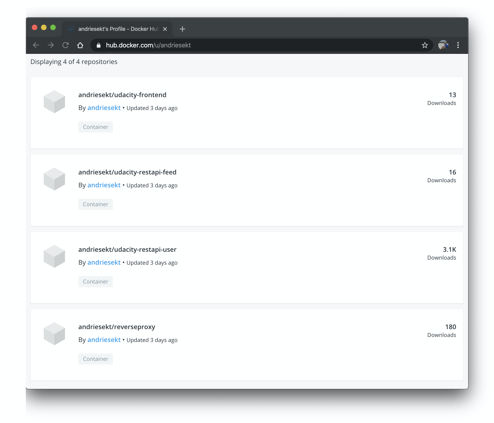
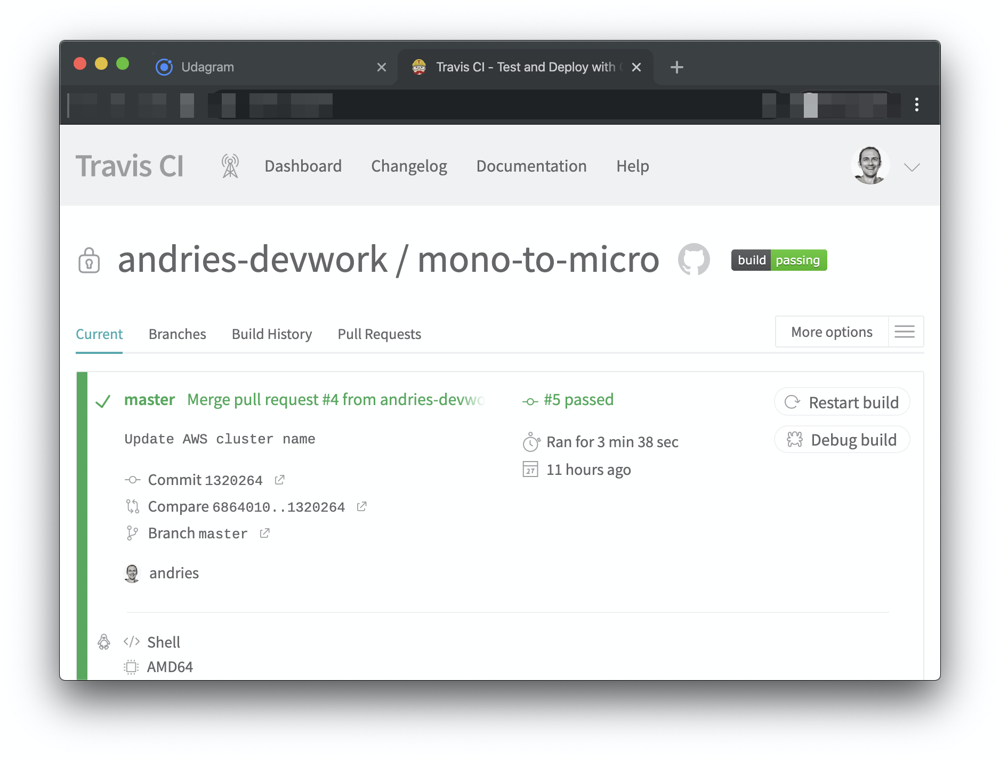
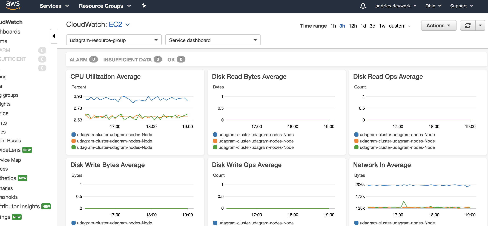

# Udagram as a Microservices Application

## Introduction

Udagram is a simple image feed application.  The functionality isn't too important, what's important is the structure.  We have here an example of a microservices driven backend that can be scaled and deployed in a cloud native way.  



Codified in this repository is:

- The AWS cloud infrastructure that the frontend and backend run on
- The Docker containerization for each microservice
- A set of independent microservices (sort of) that were derived from a single monolithic server ([source](https://github.com/scheeles/cloud-developer.git))

## Docker containers

Look for the `Dockerfile` in the various subdirectories of the source code.  Each one describes how the `node` service will be created, how the `ionic` frontent framework is defined or how the `nginx` reverse proxy is configured.  The containers can be built and pushed using a `docker-compose` configuration.



### Building container images

To manually build the Docker containers with one command, run

```bash
docker-compose -f udacity-c3-deployment/docker/docker-compose-build.yaml build --parallel
```

and then pushed to the Docker hub using

```bash
docker-compose -f udacity-c3-deployment/docker/docker-compose-build.yaml push
```

### Running the containers locally

Before you get started, ensure that the following variables are declared in your environment:
- `POSTGRESS_USERNAME`
- `POSTGRESS_PASSWORD`
- `POSTGRESS_DB`
- `POSTGRESS_HOST`
- `AWS_REGION`
- `AWS_PROFILE`
- `AWS_BUCKET`
- `JWT_SECRET`

To run the services locally, stand in the `./udacity-c3-deployment/docker` directory and execute

```bash
docker-compose up
```

## Continuous integration & deployment (CI/CD)

A CI/CD tool called [Travis](https://travis-ci.com/) is employed to automatically build and publish the Docker containers.  Containers are automatically applied to the production Kubernetes cluster.



## Cloud orchestration using Kubernetes

The `./udacity-c3-deployment/k8s` directory contain the definitions of several services and deployments.  These can be run in a tool such as `minikube` or, in our case, an AWS cluster as defined in `aws-cluster-config.yaml`.

### Running in k8s

Apply the settings, services and deployments using `kubectl` and the command

```kubectl apply -f <thing-to-apply>.yaml```

1. Configure and apply all `Secret` yaml files.  This includes your AWS credentials and database passwords, which need to base64 encoded.

2. Configure and apply all `ConfigMap` yaml files.  This injects the necessary environment variables for the container deployments to function.

3. Apply all `*-service.yaml` files.

4. Apply all `*-deployment.yaml` files.

5. Verify that all of the pods started successfully by verifying that they are in the `Running` state.

    ```
    > kubectl get pods

    NAME                            READY   STATUS    RESTARTS   AGE
    backend-feed-745b7ffb7b-twqwm   1/1     Running   0          30h
    backend-user-dfc6c559b-z8tgk    1/1     Running   0          30h
    frontend-5974c68978-scnmr       1/1     Running   0          24h
    reverseproxy-5cdd844f8f-45w8m   1/1     Running   0          30h
    ```

## Project Submission Criteria

- [x] Screenshot of TravisCI which shows the successful build and deploy steps
- [x] The public GitHub repo and the docker hub images

  ```sh
  git clone https://github.com/andries-devwork/mono-to-micro.git
  docker pull andriesekt/reverseproxy
  docker pull andriesekt/udacity-frontend
  docker pull andriesekt/udacity-restapi-feed
  docker pull andriesekt/udacity-frontend:local
  ```
  
- [x] Screenshot of `kubectl` get pod which shows all running containers
- [x] Screenshot of the application

### AWS CloudWatch

A resource group was created for the EKS cluster.  System resources can be monitored through the dashboard:


=======
## Docker Containers

Look for the `Dockerfile` in the various subdirectories of the source code.  Each one describes how the `node` service will be created, how the `ionic` frontent framework is defined or how the `nginx` reverse proxy is configured.  The containers can be built and pushed using a `docker-compose` configuration.


